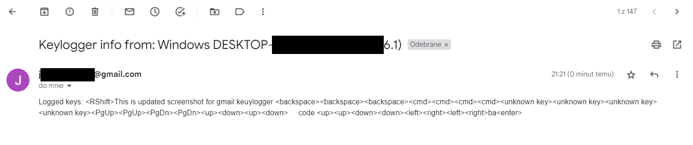

# Python 3.11 Gmail keylogger


### Keylogger written in Python 3.11 that sends logs to gmail account via smtplib.
By default keylogger sends all logs every 10 minutes. If nothing is captured after the last email, nothing will be sent as long as the program will detect another key being pressed.

#### pip requirements: 
- keyboard from pynput
- MIMEText from email.mime.text
- gethostbyname & gethostname from socket
- system from platform
- time
- smtplib
- pyinstaller (building exe)

# Instructions 


### 1. Creating app password for gmail account.

I made instruction how to generate app password that is required to use it in script.

[Link](appPassw.md)
###### (It's not that much to do as it might look)

### 2. Using gmail address and app password in keylogger.
Now when you have generated app password, just put it inside code of ```main.pyw``` with gmail address into function in line 63.


### 3. Building windows executable.

I've put ready batch script into this repository that creates executable of ```main.pyw``` using ```pyinstaller```.
If you want to change name of python script to something else you have to change name of file from "main.pyw" to your own inside ```buildExe.bat```.


After script is done, it will copy ready .exe file into the same location as ```buildExe.bat``` and delete unneeded files created by ```pyinstaller```.

#### Program doesn't hide itself so it will run from where it's currently located.

# Example message sent by program.


# VirusTotal analysis

